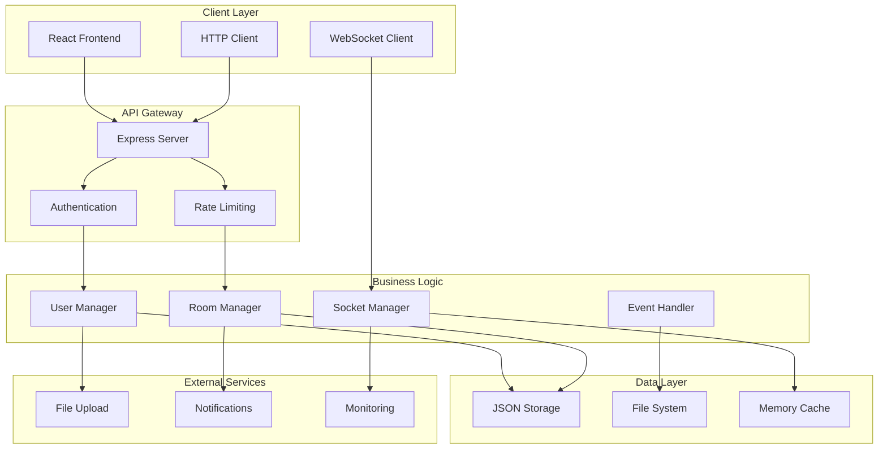
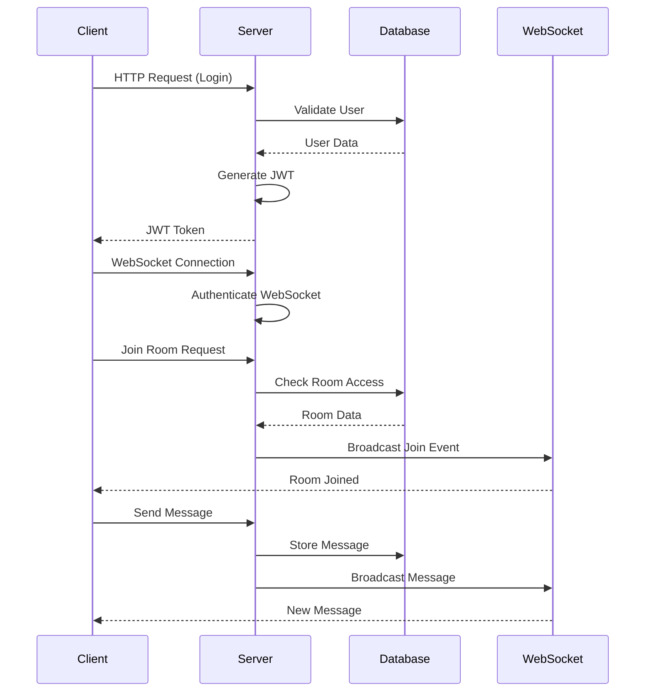

# 🏗️ هيكلية تطبيق MyRoomer

## 📋 جدول المحتويات

- [🎯 نظرة عامة](#-نظرة-عامة)
- [📁 هيكل المجلدات](#-هيكل-المجلدات)
- [🔗 بنية النظام](#-بنية-النظام)
- [💾 قاعدة البيانات](#-قاعدة-البيانات)
- [🌐 الشبكة والاتصال](#-الشبكة-والاتصال)
- [🔐 الأمان](#-الأمان)
- [📱 الواجهات](#-الواجهات)
- [🔄 تدفق البيانات](#-تدفق-البيانات)
- [⚙️ الإعدادات والتكوين](#-الإعدادات-والتكوين)
- [🚀 النشر والتشغيل](#-النشر-والتشغيل)

---

## 🎯 نظرة عامة

MyRoomer هو تطبيق لإدارة الغرف في الوقت الفعلي مبني على بنية حديثة ومقسمة (microservices-like) مع واجهة React و Node.js backend.

### 🏛️ المبادئ الأساسية
- **Modular Architecture**: بنية معيارية قابلة للتوسع
- **Real-time Communication**: اتصالات فورية باستخدام WebSocket
- **Scalable Design**: تصميم قابل للتوسع الأفقي والعمودي
- **Security First**: الأمان في مقدمة الأولويات
- **Performance Optimized**: تحسين الأداء على جميع المستويات

---

## 📁 هيكل المجلدات

```
myroomer/
├── 📁 src/                          # Frontend Source
│   ├── 📁 hooks/                    # Custom Hooks
│   │   ├── � usePeer.ts            # WebRTC Peer Connection Hook
│   │   └── � useWebSocket.ts       # WebSocket Connection Hook
│   ├── � App.tsx                   # Main App Component (124KB)
│   ├── 📄 RoomView.tsx              # Room View Component (6KB)
│   ├── � index.css                 # Global Styles (5KB)
│   └── 📄 main.tsx                  # Entry Point (231B)
├── 📁 server/                        # Backend Source
│   ├── 📁 handlers/                 # HTTP Route Handlers
│   │   ├── 📄 call.handler.ts       # Call/Video Handler (1KB)
│   │   ├── 📄 chat.handler.ts       # Chat Handler (587B)
│   │   ├── 📄 join.handler.ts       # Room Join Handler (4.8KB)
│   │   ├── 📄 lobby.handler.ts      # Lobby Handler (1.6KB)
│   │   ├── 📄 message.router.ts     # Message Router (2.6KB)
│   │   ├── 📄 owner.handler.ts      # Room Owner Handler (3.9KB)
│   │   ├── 📄 profile.handler.ts    # Profile Handler (1.9KB)
│   │   └── 📄 signal.handler.ts     # WebRTC Signal Handler (588B)
│   ├── 📁 managers/                 # Business Logic Managers
│   │   ├── 📄 roomManager.ts        # Room Management (3.6KB)
│   │   ├── 📄 socketManager.ts      # Socket Management (1.7KB)
│   │   └── 📄 userManager.ts       # User Management (2.5KB)
│   ├── 📁 services/                 # Core Services
│   │   ├── 📄 eventBus.service.ts   # Event Bus (984B)
│   │   ├── 📄 heartbeat.service.ts  # Heartbeat Service (3.5KB)
│   │   ├── 📄 persistence.service.ts # Data Persistence (907B)
│   │   ├── 📄 rateLimiter.service.ts # Rate Limiting (3.2KB)
│   │   ├── � roomActor.service.ts  # Room Actor (2.3KB)
│   │   ├── 📄 roomActorManager.service.ts # Room Actor Manager (1.9KB)
│   │   ├── 📄 roomEventHandler.service.ts # Room Event Handler (3.9KB)
│   │   ├── 📄 saveQueue.service.ts  # Save Queue (206B)
│   │   └── 📄 snapshotManager.service.ts # Snapshot Manager (2.3KB)
│   ├── 📁 types/                    # Backend Types
│   │   ├── 📄 message.types.ts      # Message Types (752B)
│   │   ├── 📄 room.types.ts         # Room Types (173B)
│   │   └── 📄 socket.types.ts       # Socket Types (242B)
│   ├── 📁 utils/                    # Server Utilities
│   │   └── 📄 logger.ts             # Logging Utility
│   ├── 📄 index.ts                  # Server Entry Point (2.4KB)
│   ├── 📄 http.ts                   # HTTP Routes Setup (6.2KB)
│   └── 📄 websocket.ts              # WebSocket Logic (2.8KB)
├── 📁 public/                        # Static Assets
│   ├── � manifest.json             # PWA Manifest (575B)
│   └── � sw.js                     # Service Worker (463B)
├── 📁 dist/                         # Build Output (Empty)
├── 📄 index.html                    # HTML Template (1KB)
├── � roomService.ts                # Room Service (3.3KB)
├── � server.old.ts                 # Old Server File (26KB)
├── � data.json                     # Application Data (491B)
├── 📄 metadata.json                 # Project Metadata (215B)
├── 📄 package.json                  # Dependencies (1KB)
├── 📄 package-lock.json             # Lock File (189KB)
├── 📄 tsconfig.json                 # TypeScript Config (220B)
├── 📄 tsconfig.server.json          # Server TypeScript Config (254B)
├── 📄 vite.config.ts               # Vite Config (705B)
├── 📄 .env.example                  # Environment Template (2KB)
├── 📄 .env.local                    # Local Environment (1KB)
├── 📄 .gitignore                    # Git Ignore (73B)
├── 📄 README.md                     # Project Documentation (6.6KB)
├── 📄 ARCHITECTURE.md               # Architecture Documentation (23KB)
├── 📄 FEATURES.md                   # Features Documentation (26KB)
```

---

## 🔗 بنية النظام

### 🏛️ الطبقات المعمارية



### 🔄 تدفق الطلب

1. **Client Request** → React Component
2. **HTTP Request** → Express Server
3. **Authentication** → JWT Validation
4. **Business Logic** → Manager Classes
5. **Data Access** → JSON File System
6. **Response** → Client
7. **Real-time Updates** → WebSocket Events

---

## 💾 قاعدة البيانات

### 📊 بنية البيانات الحالية

```json
{
  "users": {
    "username1": {
      "username": "username1",
      "displayName": "Display Name",
      "avatar": "avatar_url",
      "theme": "dark",
      "language": "ar",
      "password": "hashed_password",
      "isBanned": false,
      "blockedUsers": ["user2", "user3"],
      "createdAt": "2024-01-01T00:00:00Z"
    }
  },
  "roomOwners": {
    "room1": "owner1",
    "room2": "owner2"
  },
  "roomTags": {
    "room1": "gaming",
    "room2": "chat"
  },
  "roomSettings": {
    "room1": {
      "autoAccept": false,
      "autoReject": false,
      "maxMembers": 50,
      "isPrivate": false,
      "requireApproval": true
    }
  }
}
```

### 🗄️ هيكل الجداول المستقبلي (PostgreSQL)

```sql
-- Users Table
CREATE TABLE users (
    id UUID PRIMARY KEY DEFAULT gen_random_uuid(),
    username VARCHAR(50) UNIQUE NOT NULL,
    email VARCHAR(255) UNIQUE,
    password_hash VARCHAR(255),
    display_name VARCHAR(100),
    avatar_url VARCHAR(500),
    theme VARCHAR(20) DEFAULT 'dark',
    language VARCHAR(10) DEFAULT 'ar',
    is_active BOOLEAN DEFAULT true,
    is_banned BOOLEAN DEFAULT false,
    created_at TIMESTAMP DEFAULT CURRENT_TIMESTAMP,
    updated_at TIMESTAMP DEFAULT CURRENT_TIMESTAMP
);

-- Rooms Table
CREATE TABLE rooms (
    id UUID PRIMARY KEY DEFAULT gen_random_uuid(),
    room_id VARCHAR(100) UNIQUE NOT NULL,
    owner_id UUID REFERENCES users(id),
    name VARCHAR(255),
    description TEXT,
    tag VARCHAR(100),
    settings JSONB DEFAULT '{}',
    is_public BOOLEAN DEFAULT true,
    max_members INTEGER DEFAULT 50,
    created_at TIMESTAMP DEFAULT CURRENT_TIMESTAMP,
    updated_at TIMESTAMP DEFAULT CURRENT_TIMESTAMP
);

-- Room Members Table
CREATE TABLE room_members (
    id UUID PRIMARY KEY DEFAULT gen_random_uuid(),
    room_id UUID REFERENCES rooms(id),
    user_id UUID REFERENCES users(id),
    role VARCHAR(20) DEFAULT 'member', -- owner, admin, member, guest
    joined_at TIMESTAMP DEFAULT CURRENT_TIMESTAMP,
    UNIQUE(room_id, user_id)
);

-- Messages Table
CREATE TABLE messages (
    id UUID PRIMARY KEY DEFAULT gen_random_uuid(),
    room_id UUID REFERENCES rooms(id),
    user_id UUID REFERENCES users(id),
    content TEXT NOT NULL,
    message_type VARCHAR(20) DEFAULT 'text',
    metadata JSONB,
    created_at TIMESTAMP DEFAULT CURRENT_TIMESTAMP
);

-- Files Table
CREATE TABLE files (
    id UUID PRIMARY KEY DEFAULT gen_random_uuid(),
    user_id UUID REFERENCES users(id),
    room_id UUID REFERENCES rooms(id),
    filename VARCHAR(255) NOT NULL,
    original_name VARCHAR(255),
    mime_type VARCHAR(100),
    file_size BIGINT,
    file_path VARCHAR(500),
    is_public BOOLEAN DEFAULT false,
    download_count INTEGER DEFAULT 0,
    created_at TIMESTAMP DEFAULT CURRENT_TIMESTAMP
);
```

---

## 🌐 الشبكة والاتصال

### 🔌 WebSocket Architecture

```javascript
// WebSocket Event Flow
const websocketEvents = {
  // Client to Server
  'join-room': { data: { roomId, userId } },
  'leave-room': { data: { roomId, userId } },
  'chat-message': { data: { roomId, message, type } },
  'signal': { data: { roomId, signal, targetId } },
  'room-settings': { data: { roomId, settings } },
  
  // Server to Client
  'room-joined': { data: { room, members } },
  'room-left': { data: { roomId } },
  'chat-message': { data: { message, sender } },
  'user-joined': { data: { user, roomId } },
  'user-left': { data: { userId, roomId } },
  'signal': { data: { signal, fromId } },
  'room-updated': { data: { room, changes } },
  'member-kicked': { data: { userId, reason } }
};
```

### 🌐 Network Configuration

```javascript
// Network Settings
const networkConfig = {
  server: {
    port: 3002,
    host: '0.0.0.0',
    cors: {
      origin: process.env.FRONTEND_URL || 'http://localhost:3000',
      credentials: true
    }
  },
  websocket: {
    path: '/socket.io',
    transports: ['websocket', 'polling'],
    pingTimeout: 60000,
    pingInterval: 25000
  },
  rateLimit: {
    windowMs: 15 * 60 * 1000, // 15 minutes
    max: 100, // limit each IP to 100 requests per windowMs
    message: 'Too many requests from this IP'
  }
};
```

---

## 🔐 الأمان

### 🛡️ Security Layers

```javascript
// Security Configuration
const securityConfig = {
  authentication: {
    jwt: {
      secret: process.env.JWT_SECRET,
      expiresIn: '24h',
      algorithm: 'HS256'
    },
    bcrypt: {
      saltRounds: 12
    }
  },
  validation: {
    username: {
      minLength: 3,
      maxLength: 50,
      pattern: /^[a-zA-Z0-9]+$/
    },
    password: {
      minLength: 8,
      requireUppercase: true,
      requireLowercase: true,
      requireNumbers: true,
      requireSpecialChars: true
    },
    roomId: {
      minLength: 1,
      maxLength: 100,
      pattern: /^[a-zA-Z0-9_-]+$/
    }
  },
  rateLimiting: {
    auth: { windowMs: 900000, max: 5 }, // 15 minutes, 5 attempts
    general: { windowMs: 900000, max: 100 }, // 15 minutes, 100 requests
    upload: { windowMs: 3600000, max: 10 } // 1 hour, 10 uploads
  }
};
```

### 🔒 Security Middleware Stack

```javascript
// Security Middleware
app.use(helmet()); // Security headers
app.use(cors(corsOptions)); // CORS configuration
app.use(rateLimit(limitOptions)); // Rate limiting
app.use(express.json({ limit: '10mb' })); // JSON parsing
app.use(express.urlencoded({ extended: true })); // URL encoding
app.use(sanitizeMiddleware); // Input sanitization
app.use(authMiddleware); // Authentication
app.use(validationMiddleware); // Input validation
```

---

## 📱 الواجهات

### 🎨 Frontend Architecture

```javascript
// Component Hierarchy
const componentStructure = {
  App: {
    Router: {
      HomePage: {
        Header,
        Lobby,
        Footer
      },
      LoginPage: {
        LoginForm,
        RegisterForm
      },
      RoomPage: {
        RoomHeader,
        VideoArea,
        ChatArea,
        MemberList,
        Controls
      },
      AdminPage: {
        AdminSidebar,
        Dashboard,
        UserManagement,
        RoomManagement,
        SystemSettings
      }
    }
  }
};
```

### 🎯 State Management

```javascript
// Redux Store Structure
const storeStructure = {
  auth: {
    user: null,
    token: null,
    isAuthenticated: false,
    loading: false,
    error: null
  },
  rooms: {
    currentRoom: null,
    availableRooms: [],
    userRooms: [],
    loading: false,
    error: null
  },
  chat: {
    messages: [],
    typingUsers: [],
    unreadCount: 0,
    loading: false
  },
  ui: {
    theme: 'dark',
    language: 'ar',
    sidebarOpen: true,
    notifications: []
  }
};
```

---

## 🔄 تدفق البيانات

### 📊 Data Flow Diagram



### 🔄 Event System

```javascript
// Event Bus Architecture
class EventBus {
  constructor() {
    this.events = new Map();
  }
  
  on(event, callback) {
    if (!this.events.has(event)) {
      this.events.set(event, []);
    }
    this.events.get(event).push(callback);
  }
  
  emit(event, data) {
    if (this.events.has(event)) {
      this.events.get(event).forEach(callback => callback(data));
    }
  }
}

// Event Types
const eventTypes = {
  USER_CREATED: 'user:created',
  USER_UPDATED: 'user:updated',
  USER_DELETED: 'user:deleted',
  ROOM_CREATED: 'room:created',
  ROOM_UPDATED: 'room:updated',
  ROOM_DELETED: 'room:deleted',
  MEMBER_JOINED: 'member:joined',
  MEMBER_LEFT: 'member:left',
  MESSAGE_SENT: 'message:sent'
};
```

---

## ⚙️ الإعدادات والتكوين

### 📝 Configuration Files

```javascript
// config/app.js
const config = {
  development: {
    port: 3002,
    database: {
      type: 'json',
      path: './data.json'
    },
    logging: {
      level: 'debug',
      file: './logs/app.log'
    }
  },
  production: {
    port: process.env.PORT || 3002,
    database: {
      type: 'postgresql',
      host: process.env.DB_HOST,
      port: process.env.DB_PORT,
      database: process.env.DB_NAME,
      username: process.env.DB_USER,
      password: process.env.DB_PASSWORD
    },
    logging: {
      level: 'info',
      file: './logs/app.log'
    }
  }
};
```

### 🌍 Environment Variables

```bash
# .env.example
# Application
NODE_ENV=development
PORT=3002
FRONTEND_URL=http://localhost:3000

# Database
DB_TYPE=json
DB_PATH=./data.json
# For PostgreSQL:
# DB_HOST=localhost
# DB_PORT=5432
# DB_NAME=myroomer
# DB_USER=myroomer
# DB_PASSWORD=password

# Security
JWT_SECRET=your-super-secret-jwt-key
BCRYPT_ROUNDS=12

# File Upload
UPLOAD_DIR=./uploads
MAX_FILE_SIZE=50MB

# Logging
LOG_LEVEL=info
LOG_DIR=./logs

# Rate Limiting
RATE_LIMIT_WINDOW=900000
RATE_LIMIT_MAX=100

# WebSocket
WS_PATH=/socket.io
WS_PING_TIMEOUT=60000
WS_PING_INTERVAL=25000
```

---

## 🚀 النشر والتشغيل

### 🐳 Docker Configuration

```dockerfile
# Dockerfile
FROM node:18-alpine

WORKDIR /app

# Install dependencies
COPY package*.json ./
RUN npm ci --only=production

# Copy source code
COPY . .

# Build application
RUN npm run build

# Create non-root user
RUN addgroup -g 1001 -S nodejs
RUN adduser -S myroomer -u 1001

USER myroomer

EXPOSE 3002

CMD ["npm", "start"]
```

### 📋 Docker Compose

```yaml
# docker-compose.yml
version: '3.8'

services:
  app:
    build: .
    ports:
      - "3002:3002"
    environment:
      - NODE_ENV=production
      - PORT=3002
    volumes:
      - ./uploads:/app/uploads
      - ./logs:/app/logs
      - ./data.json:/app/data.json
    restart: unless-stopped

  redis:
    image: redis:alpine
    ports:
      - "6379:6379"
    volumes:
      - redis-data:/data
    restart: unless-stopped

  postgres:
    image: postgres:alpine
    environment:
      - POSTGRES_DB=myroomer
      - POSTGRES_USER=myroomer
      - POSTGRES_PASSWORD=password
    volumes:
      - postgres-data:/var/lib/postgresql/data
    ports:
      - "5432:5432"
    restart: unless-stopped

volumes:
  redis-data:
  postgres-data:
```

### 🚀 Deployment Scripts

```bash
#!/bin/bash
# scripts/deploy.sh

# Build application
echo "Building application..."
npm run build

# Run tests
echo "Running tests..."
npm test

# Build Docker image
echo "Building Docker image..."
docker build -t myroomer:latest .

# Deploy to production
echo "Deploying to production..."
docker-compose up -d

# Health check
echo "Checking health..."
curl -f http://localhost:3002/health || exit 1

echo "Deployment completed successfully!"
```

---

## 📊 المراقبة والصيانة

### 📈 Monitoring Setup

```javascript
// monitoring/metrics.js
const prometheus = require('prom-client');

// Create metrics
const httpRequestDuration = new prometheus.Histogram({
  name: 'http_request_duration_seconds',
  help: 'Duration of HTTP requests in seconds',
  labelNames: ['method', 'route', 'status']
});

const activeConnections = new prometheus.Gauge({
  name: 'websocket_active_connections',
  help: 'Number of active WebSocket connections'
});

const roomCount = new prometheus.Gauge({
  name: 'rooms_total',
  help: 'Total number of rooms'
});

// Export metrics
module.exports = {
  httpRequestDuration,
  activeConnections,
  roomCount
};
```

### 🔍 Health Checks

```javascript
// health/health.js
const healthCheck = {
  async check() {
    const checks = {
      database: await this.checkDatabase(),
      filesystem: await this.checkFilesystem(),
      memory: await this.checkMemory(),
      websocket: this.checkWebSocket()
    };
    
    const healthy = Object.values(checks).every(check => check.status === 'healthy');
    
    return {
      status: healthy ? 'healthy' : 'unhealthy',
      timestamp: new Date().toISOString(),
      checks
    };
  }
};
```

---

## 🎯 الخلاصة

MyRoomer يتبع بنية حديثة وقابلة للتوسع مع:

- ✅ **Frontend**: React مع TypeScript و Redux
- ✅ **Backend**: Node.js مع Express و WebSocket
- ✅ **Data Storage**: JSON حالياً مع إمكانية الترقية لـ PostgreSQL
- ✅ **Security**: JWT مصادقة، تشفير، تحديد المعدل
- ✅ **Scalability**: بنية معيارية، WebSocket، التخزين المؤقت
- ✅ **Monitoring**: مقاييس Prometheus، فحوصات صحية
- ✅ **Deployment**: Docker، Docker Compose، CI/CD

هذه البية توفر أساساً قوياً للتطوير المستمر والتوسع المستقبلي! 🚀🏗️
